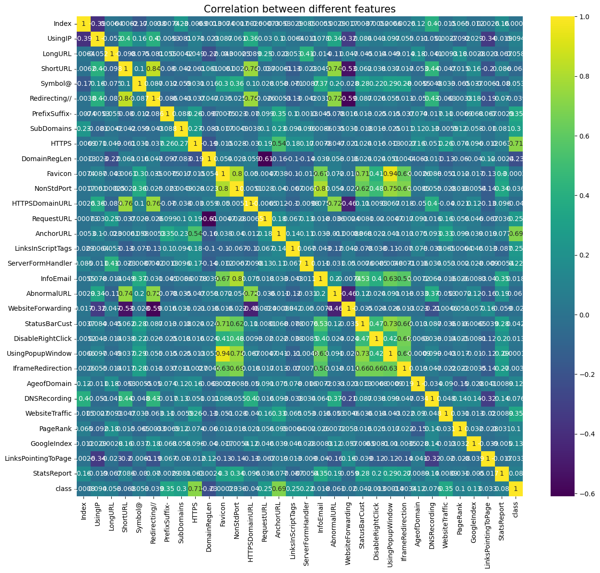

# Phishing Website Detection Using Machine Learning

Detecting phishing websites using machine learning involves leveraging algorithms to analyze features and patterns in web data to distinguish between legitimate and malicious websites. The important features for the detection of phishing website include 


One of the most effective approaches for uncovering malicious activities is the utilization of Machine Learning. This is because a considerable number of Phishing attacks share distinct characteristics that are identifiable through machine learning methods. The dataset is divided into 80% for training and 20% for testing, equating to 8843 training samples and 2211 testing samples. The observable pattern within the dataset confirms the nature of this task as a supervised machine-learning problem.

Two primary categories of supervised machine learning problems exist: classification and regression.

In the context of this dataset, it falls into the classification category, where the input URL is categorized as either phishing (1) or legitimate (0).

The classification-based supervised machine learning models selected for training the dataset in this project include:

Decision Tree,Random Forest,Adaboost,Logistic regression,Support Vector Machine,kNN and Gradient Boosting.

The Logistic Regression accuracy score is 0.935, the Random Forest accuracy score is 0.975, the SVC accuracy score is 0.953, the Decision Tree accuracy score is 0.963, the KNN accuracy score is 0.945, the Gradient Boosting accuracy score is 0.952 and the AdaBoost accuracy score is 0.944.

Out of 7 ML models, Random Forest and Decision Tree are the two top-performing models.


## Directory Tree

```bash
  |── app.py
  |── adb_model.pkl
  |── cv_model.pkl
  |── dt_model.pkl
  |── gbc_model.pkl
  |── knn_model.pkl
  |── lr_model.pkl
  |── rf_model.pkl
  |── req.txt
  |── download.png
```
## Installation

Install all Dependency with pip

```bash
  pip install -r req.txt
```
    
## Model Result Table



| Modelname | Accuracy Score | F1 Score	| Precision Score |
| :-----: | :---: | :---: | :---: |
| Logistic Regression	 | 0.935   | 0.941   | 0.917   |
| SVC	 | 0.953   | 0.957   | 0.946   |
| Random Forest	| 0.975   | 0.978   | 0.988   |
| Decision Tree	| 0.963   | 0.966   | 0.990   |
| K-Nearest Neighbors	| 0.945   | 0.950   | 0.971   |
| Gradient Boosting	| 0.952   | 0.957   | 0.945   |
| AdaBoost	| 0.944   | 0.949   | 0.928   |
